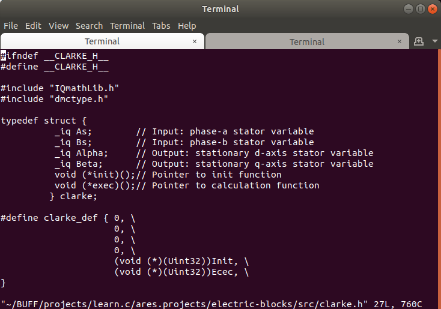

### dotfiles

 Here are my personal environment:
  * vm: vmware, docker
  * operation system: ubuntu
  * installer: ansible
  * shell: bash
  * editor: neovim
  * browser: chrome
  * file manager: doublecmd
  The personal enviromnment configured for c/go/js programming.

#### Example:

Other examples are here [/docs](./docs)

#### Dirs

  * `conf.ansible` - instructions/scripts/files for configure/install environment
  * `conf.bash` - dotfiles for std.shell
  * `conf.util` - dotfiles for all other utilites like eslint/youcompleteme/..
  * `docs`- docs/faqs/examples

#### Preparation

  * `cd ~`
  * `sudo apt-get install git`
  * `git clone https://github.com/asm-jaime/dotfiles`
  * `bash ~/dotfiles/conf.ansible/start.install.ansible.compatible.sh`
  * `sudo apt install gcc && sudo apt install build-essential && sudo apt-get update`
#### SSH
  * copy your `.ssh` to your home directory
  * `cd ~`
  * `chown -R your_user:your_user .ssh` (`chown -R jaime:jaime .ssh`)
  
#### vmwtools (only when under vmware environment)
  * `sudo apt install net-tools`
  * `put the linux.iso from host system to virtual cdrom, or click 'menu->Install VMware Tools...'`
  * `copy VMWareTools*.gz to /tmp and cd /tmp/vmware-tools`
  * `sudo ./vmware-install.pl`
    * if the warning: 'the path is not valid path to the gcc binary', press 'y'->'/usr/bin/gcc'->'n'
    * if the warning: 'Would you like to enable VMware automatic kernel modules?', press 'y'

#### Sequence installation (ansible and sudo password are required):
  * `cd ~/dotfiles/conf.ansible`
  * `ansible-playbook play.bash.yml`
  * `ansible-playbook play.chrome.yml`
  * `ansible-playbook play.doublecmd.yml`
  * `ansible-playbook play.git.yml` (quick configure your git. `~/.ssh` keys required)
  * `ansible-playbook play.node.yml`
  * `ansible-playbook play.docker.yml` (logout required)
  * `ansible-playbook play.mongodb.yml`
  * `ansible-playbook play.vi.yml`
  * `ansible-playbook play.vi-ale.yml`
